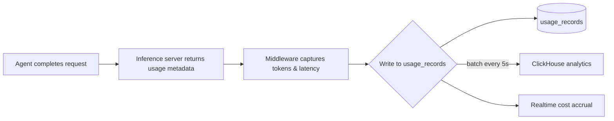

# Analytics & Reporting

## 1. Usage Tracking

### Data Model

Usage data is stored in the `usage_records` table, where each row captures one completion request.

| Column             | Type                      | Description                                        |
|--------------------|---------------------------|----------------------------------------------------|
| `id`               | UUID (PK)                 | Unique record identifier                           |
| `workspace_id`     | UUID (FK → workspaces)    | Owning workspace                                   |
| `agent_id`         | UUID (FK → agents)        | Agent that issued the request                      |
| `server_id`        | UUID (FK → servers)       | Inference server used                              |
| `model`            | VARCHAR(128)              | Model identifier (e.g. `claude-sonnet-4`)         |
| `input_tokens`     | INTEGER                   | Token count consumed by the request                |
| `output_tokens`    | INTEGER                   | Token count generated in the response              |
| `input_cost`       | NUMERIC(12,8)             | Cost of input tokens in USD                        |
| `output_cost`      | NUMERIC(12,8)             | Cost of output tokens in USD                       |
| `total_cost`       | NUMERIC(12,8)             | Computed as `input_cost + output_cost`             |
| `latency_ms`       | INTEGER                   | End-to-end wall-clock latency in milliseconds      |
| `tokens_per_second`| NUMERIC(10,2)             | `(input_tokens + output_tokens) / (latency_ms / 1000)` |
| `status`           | VARCHAR(32)               | `success`, `error`, `cancelled`, `timeout`         |
| `error_code`       | VARCHAR(64)               | Machine-readable error code (nullable)             |
| `created_at`       | TIMESTAMPTZ               | When the request completed                         |
| `updated_at`       | TIMESTAMPTZ               | Last modification timestamp                        |

**Indexes:**

```sql
CREATE INDEX idx_usage_records_workspace_created
    ON usage_records (workspace_id, created_at DESC);

CREATE INDEX idx_usage_records_server_created
    ON usage_records (server_id, created_at DESC);

CREATE INDEX idx_usage_records_model_created
    ON usage_records (model, created_at DESC);
```

### Cost Accrual

Cost is computed at write time using the server's **hourly rate configuration** (see §3). The formula follows the inference-server's per-model pricing table:

```
input_cost  = input_tokens  × input_token_price
output_cost = output_tokens × output_token_price
```

- Prices are stored in USD per 1M tokens, consistent with provider billing.
- Costs are rounded to 8 decimal places at insert time to avoid floating-point drift.
- A background reconciliation job (runs hourly) validates accrued costs against the raw `usage_records` table and corrects any drift due to pricing configuration changes.

### Ingestion Pipeline



1. The inference server returns token counts and timing as response metadata.
2. An API middleware hook intercepts every completion response and marshals a `usage_records` row.
3. Rows are inserted synchronously for accurate billing; a 5-second batch writer also streams the same data to ClickHouse for dashboard aggregation.

---

## 2. Dashboard Analytics

### Aggregate GPU Utilization

The dashboard displays GPU-utilization metrics aggregated across the entire workspace. Data is sourced from GPU-monitoring agents that report every 15 seconds.

**Key metrics:**

- **Average GPU Utilisation (%)** — arithmetic mean across all GPUs in the workspace over the selected window.
- **Peak GPU Utilisation (%)** — maximum observed utilisation in the window.
- **Memory Used / Total (GiB)** — aggregate memory consumption.
- **Active Servers** — count of servers that processed at least one request in the window.

### Per-Server Breakdown

A table and drill-down panel show each server individually:

| Server Name       | Model(s)    | Avg GPU % | Peak GPU % | Memory (GiB) | Req/s | Active Agents |
|-------------------|-------------|-----------|------------|--------------|-------|---------------|
| `gpu-a100-01`     | Llama 3 70B | 72.3      | 98.1       | 38.2 / 80    | 4.7   | 3             |
| `gpu-h100-02`     | Sonnet 4    | 45.8      | 82.4       | 22.1 / 80    | 12.1  | 5             |
| `gpu-rtx-4090-01` | Mistral     | 31.2      | 67.0       | 14.0 / 24    | 8.3   | 2             |

- Clicking a row opens a real-time detail panel with live GPU metrics, recent request log, and cost accumulation.
- Sorting and filtering by any column are supported.

### Historical Trends

Trend charts span configurable time windows: 1 hour, 6 hours, 24 hours, 7 days, 30 days.

**Chart types:**

1. **GPU Utilisation Over Time** — area chart with per-server line series, 15-second resolution.
2. **Request Volume (req/s)** — bar chart, 1-minute buckets.
3. **Total Tokens Processed** — stacked area chart (input vs output).
4. **Cost Accrual** — cumulative line chart per server.

All charts support interactive brushing to narrow the time window, and a CSV/JSON export button.

### Data Source

Dashboard data is served from a **ClickHouse** materialised view that aggregates `usage_records` into 1-minute buckets:

```sql
CREATE MATERIALIZED VIEW mv_usage_minutely
ENGINE = SummingMergeTree
ORDER BY (workspace_id, server_id, bucket)
AS SELECT
    workspace_id,
    server_id,
    toStartOfMinute(created_at) AS bucket,
    count()                       AS request_count,
    sum(input_tokens)             AS input_tokens_total,
    sum(output_tokens)            AS output_tokens_total,
    sum(total_cost)               AS cost_total,
    avg(latency_ms)               AS avg_latency_ms,
    max(latency_ms)               AS max_latency_ms
FROM usage_records
GROUP BY workspace_id, server_id, bucket;
```

---

## 3. Cost Comparison

### Per-Server Hourly Pricing Configuration

Servers define their pricing in a configuration file (`servers/<server_id>/pricing.toml`):

```toml
[server]
name = "gpu-a100-01"
hourly_rate_usd = 2.50
currency = "USD"

[models."claude-sonnet-4"]
input_price_per_1M = 15.00
output_price_per_1M = 75.00

[models."llama-3-70b"]
input_price_per_1M = 2.00
output_price_per_1M = 6.00
```

- `hourly_rate_usd` is used for cost-projection charts and idle-cost calculations.
- Model-level prices are used for per-request cost accrual (see §1).

The pricing configuration is hot-reloadable — changes take effect within 60 seconds without restarting the server.

### Cost Projection Charts

Charts are rendered using **ECharts** (Apache ECharts, version 5.x) and embedded in the dashboard.

**Monthly Cost Projection:**

```
Based on actual spend over the last 7 days, projected monthly cost:

  Server        | Actual (7d) | Projected (30d) | Confidence
  --------------|-------------|-----------------|-----------
  gpu-a100-01   | $420.50     | $1,801.43       | ±12%
  gpu-h100-02   | $891.20     | $3,819.43       | ±8%
  gpu-rtx-4090  | $102.30     | $438.43         | ±18%

  Workspace Total Projected: $6,059.29
```

- Projection uses a simple linear extrapolation over the trailing window.
- Confidence bands are calculated from daily variance (coefficient of variation).
- Charts include interactive tooltips and legend toggling.

**Model-Level Cost Breakdown (Sunburst Chart):**

```
         ┌──────────────────────────────┐
         │      Total $6,059            │
         │  ┌─────────────────────┐     │
         │  │ Claude Sonnet 4     │     │
         │  │ $3,250  (53.6%)    │     │
         │  │ ┌───────┬────────┐ │     │
         │  │ │ Input │ Output │ │     │
         │  │ │$542   │$2,708  │ │     │
         │  │ └───────┴────────┘ │     │
         │  ├─────────────────────┤     │
         │  │ Llama 3 70B        │     │
         │  │ $2,100  (34.7%)    │     │
         │  └─────────────────────┘     │
         │  ...                         │
         └──────────────────────────────┘
```

### API Endpoint

```
GET /api/v1/analytics/cost-comparison
  ?workspace_id=<uuid>
  &start=<ISO 8601>
  &end=<ISO 8601>
  &granularity=hourly|daily|monthly

Response:
{
  "servers": [
    {
      "server_id": "uuid",
      "server_name": "string",
      "hourly_rate": 2.50,
      "models": [
        {
          "model": "claude-sonnet-4",
          "input_cost": 542.10,
          "output_cost": 2708.50,
          "total_cost": 3250.60,
          "input_tokens": 36_140_000,
          "output_tokens": 36_113_333
        }
      ],
      "total_cost": 3250.60,
      "projected_monthly": 3801.43,
      "projection_confidence": 0.92
    }
  ],
  "workspace_total": 6059.29,
  "projected_total": 6250.00
}
```

---

## 4. Benchmark Reporting

Benchmark reports are generated when a user runs an evaluator (e.g. a model-evaluation suite against a test dataset). Results are stored in the `benchmark_results` table.

### Key Metrics

| Metric               | Description                                      | Source                           |
|----------------------|--------------------------------------------------|----------------------------------|
| **p50 Latency**      | Median request latency in ms                     | `usage_records.latency_ms`       |
| **p95 Latency**      | 95th percentile request latency in ms            | `usage_records.latency_ms`       |
| **p99 Latency**      | 99th percentile request latency in ms            | `usage_records.latency_ms`       |
| **Throughput**       | Requests per second (req/s)                      | `count / time_window_seconds`    |
| **Tokens per Second**| Combined input + output tokens per second        | `total_tokens / time_window_seconds` |
| **Cost per 1K Tokens** | Cost per 1,000 tokens, averaged               | `total_cost / (total_tokens / 1000)` |

### Comparison Charts

**Bar Chart — Latency Percentiles per Model:**
```
Latency (ms)
  ^
  |  ████
  |  ████  ████
  |  ████  ████  ████
  |  ████  ████  ████  ████
  |  ████  ████  ████  ████  ████
  +----------------------------------→
    Sonnet  Llama  Mistral  GPT-4o  Gemini
    █ p50   █ p95   █ p99
```

**Scatter Chart — Throughput vs Cost per 1K Tokens:**
```
Cost/1K (log)
  ^
  |         ◆ Sonnet 4
  |                         ◆ GPT-4o
  |    ◆ Gemini
  |                    ◆ Llama 3
  |  ◆ Mistral
  +--------------------------------→
              Throughput (req/s) (log)
```

**Radar Chart — Multi-Dimensional Comparison:**
```
                     Quality Score
                        ╱╲
                       ╱  ╲
         Latency ◄────╱────╲────► Throughput
                   ╱        ╲
                  ╱──────────╲
               Cost         Tokens/s
    ── Sonnet 4    ── Llama 3    ── Mistral
```

### API Endpoint

```
GET /api/v1/analytics/benchmarks
  ?workspace_id=<uuid>
  &benchmark_id=<uuid>
  &models=claude-sonnet-4,llama-3-70b

Response:
{
  "benchmark": {
    "id": "uuid",
    "name": "Code Generation v2",
    "dataset": "humaneval-plus",
    "run_at": "2026-06-07T12:00:00Z"
  },
  "results": [
    {
      "model": "claude-sonnet-4",
      "latency_p50_ms": 1450,
      "latency_p95_ms": 3200,
      "latency_p99_ms": 5100,
      "throughput_req_per_s": 5.2,
      "tokens_per_second": 1820,
      "cost_per_1k_tokens": 0.042,
      "total_requests": 500,
      "total_cost": 3.15
    }
  ]
}
```

---

## 5. Data Retention

### Retention Policy

Aggregated data is retained at different granularities according to the following schedule:

| Granularity | Raw interval | Retention Period | Storage Engine                  |
|-------------|--------------|------------------|----------------------------------|
| **Raw**     | 2 seconds    | 24 hours         | ClickHouse (ReplicatedMergeTree) |
| **1-minute**| 1 minute     | 30 days          | ClickHouse (SummingMergeTree)    |
| **5-minute**| 5 minutes    | 1 year           | ClickHouse (SummingMergeTree)    |
| **Hourly**  | 1 hour       | Forever (cloud)  | PostgreSQL (partitioned)         |

**Explanation:**

- **Raw (2s → 24h):** Full-resolution request logs. Used for real-time dashboards and live debugging. Purged after 24 hours.
- **1-minute (1m → 30d):** Rolled-up aggregates. Sufficient for trend analysis and daily reports. Purged after 30 days.
- **5-minute (5m → 1y):** Coarser aggregates kept for annual comparisons, cost audits, and compliance. Purged after one year.
- **Hourly (cloud only):** Perpetual retention for billing audits and historical cost allocation.

### Rollup Pipeline

```mermaid
flowchart LR
    A[usage_records\n(raw, 2s)] -->|1m cron| B[mv_usage_minutely\n(1m buckets)]
    B -->|30m cron| C[mv_usage_5min\n(5m buckets)]
    C -->|1h cron| D[usage_hourly\n(PostgreSQL)]
    A -->|TTL: 24h| E[DELETE raw]
    B -->|TTL: 30d| F[DELETE 1m]
    C -->|TTL: 1y| G[DELETE 5m]
```

Rollups are computed by background cron jobs:

```sql
-- 1-minute rollup (runs every 60s)
INSERT INTO usage_5min
SELECT
    workspace_id,
    server_id,
    toStartOfFiveMinutes(bucket) AS bucket_5m,
    sum(request_count),
    sum(input_tokens_total),
    sum(output_tokens_total),
    sum(cost_total),
    avg(avg_latency_ms)
FROM mv_usage_minutely
WHERE bucket >= now() - INTERVAL 31 DAY
  AND bucket < toStartOfMinute(now())
GROUP BY workspace_id, server_id, bucket_5m;
```

### Configuration per Workspace

Workspaces may override the default retention periods via their settings:

```json
{
  "analytics": {
    "retention": {
      "raw_hours": 48,
      "minute_days": 60,
      "five_minute_days": 365
    }
  }
}
```

These overrides are stored in the `workspaces.settings` JSONB column.

### Cleanup Job

A daily cleanup job runs at 03:00 UTC in every workspace:

```sql
-- Delete raw records older than the configured retention
DELETE FROM usage_records
WHERE created_at < now() - INTERVAL '1 day' * (
    SELECT COALESCE(
        (settings->'analytics'->'retention'->>'raw_hours')::int / 24,
        1
    )
    FROM workspaces WHERE id = :workspace_id
);

-- Delete 1-minute aggregates older than retention
DELETE FROM usage_5min
WHERE bucket < now() - INTERVAL '1 day' * (
    SELECT COALESCE(
        (settings->'analytics'->'retention'->>'minute_days')::int,
        30
    )
    FROM workspaces WHERE id = :workspace_id
);
```

- The job logs the number of deleted rows and elapsed time.
- If a workspace's retention is shorter than the default, the extra data is purged immediately on configuration change (via a trigger).

### Log Retention

- Application logs (structured JSON) are retained for **30 days** by default in cloud and **7 days** in self-hosted.
- Per-workspace override via `workspaces.settings.analytics.log_retention_days`.
- Logs are stored in ClickHouse (`app_logs` table) and purged by the same daily cleanup job.

---

## 6. Billing Reports (Cloud Only)

### Monthly Spend

A per-workspace monthly-spend summary is computed on the **1st of each month at 00:05 UTC**:

```sql
INSERT INTO billing_monthly (
    workspace_id, billing_month,
    total_spend, input_cost, output_cost,
    server_breakdown, model_breakdown,
    request_count, agent_count
)
SELECT
    workspace_id,
    date_trunc('month', created_at) AS billing_month,
    sum(total_cost),
    sum(input_cost),
    sum(output_cost),
    jsonb_object_agg(server_id, server_cost),
    jsonb_object_agg(model, model_cost),
    count(*),
    count(DISTINCT agent_id)
FROM usage_records
WHERE created_at >= date_trunc('month', now()) - INTERVAL '1 month'
  AND created_at <  date_trunc('month', now())
GROUP BY workspace_id;
```

The result is accessible via:

```
GET /api/v1/billing/monthly?workspace_id=<uuid>
```

**Response:**

```json
{
  "workspace_id": "uuid",
  "workspace_name": "Acme Corp",
  "billing_month": "2026-06-01T00:00:00Z",
  "total_spend": 6059.29,
  "input_cost": 984.50,
  "output_cost": 5074.79,
  "request_count": 124830,
  "agent_count": 12,
  "server_breakdown": {
    "gpu-a100-01": { "spend": 1801.43, "requests": 42300 },
    "gpu-h100-02": { "spend": 3819.43, "requests": 67500 },
    "gpu-rtx-4090-01": { "spend": 438.43, "requests": 15030 }
  },
  "model_breakdown": {
    "claude-sonnet-4": { "spend": 3250.60, "requests": 41200 },
    "llama-3-70b": { "spend": 2100.00, "requests": 62400 },
    "mistral": { "spend": 438.43, "requests": 15030 }
  }
}
```

### Invoice History

- Invoices are generated on the 1st of each month and stored as PDFs.
- Accessible via `GET /api/v1/billing/invoices?workspace_id=<uuid>&month=2026-06`.
- The raw invoice data (JSON) is retained in the `billing_invoices` table indefinitely.
- Self-hosted deployments see a **disabled** endpoint returning `{ "cloud_only": true }`.

### Workspace-Level Cost Allocation

When a workspace is part of an organisation, costs can be allocated to sub-teams or projects via **cost allocation tags**:

- Tags are arbitrary key-value pairs set on agents (e.g. `{ "department": "engineering", "project": "model-training" }`).
- The monthly billing report breaks down spend by tag:

```json
{
  "cost_allocation": {
    "department": {
      "engineering": { "spend": 4500.00, "pct": 74.3 },
      "research":    { "spend": 1200.00, "pct": 19.8 },
      "unallocated": { "spend": 359.29,  "pct": 5.9 }
    }
  }
}
```

---

## 7. Alerts

### Alert Types

| Alert                        | Severity | Description                                          | Default Threshold                  |
|------------------------------|----------|------------------------------------------------------|------------------------------------|
| **Billing Threshold**        | Warning  | Monthly spend exceeds configured budget              | 80% / 100% of budget               |
| **Agent Disconnection**      | Critical | An agent has been unreachable for > 5 minutes        | 5 minutes                          |
| **GPU Temperature**          | Warning  | GPU junction temperature exceeds safe threshold      | 85 °C                              |
| **Disk Space**               | Critical | Filesystem utilisation exceeds threshold             | 90%                                |

### Billing Threshold Alerts

1. Each workspace may define a **monthly budget** in its settings:

```json
{
  "billing": {
    "monthly_budget_usd": 5000.00
  }
}
```

2. A background job runs **every hour** and compares `SUM(total_cost)` for the current month against the budget.
3. If spend exceeds **80%** of budget, a **warning** notification is dispatched.
4. If spend exceeds **100%**, a **critical** notification is dispatched and the optional **auto-pause** flag is evaluated. When auto-pause is enabled, new inference requests are rejected with HTTP 429.
5. Notifications are sent via:
   - In-app notification (dashboard bell icon)
   - Email (to workspace owner)
   - Webhook (configurable URL)

### Agent Disconnection Alerts

1. Each agent sends a **heartbeat** every 30 seconds to the control plane.
2. If no heartbeat is received for the configured grace period (default 5 minutes), the agent is marked as `disconnected`.
3. A critical alert fires immediately on disconnection.
4. The alert auto-resolves when the agent reconnects.

### GPU Temperature Alerts

1. GPU-monitoring daemons report junction temperature every 15 seconds.
2. If temperature exceeds the threshold (default 85 °C) for more than 3 consecutive readings, a warning alert fires.
3. If temperature exceeds 95 °C, the inference server automatically throttles or migrates requests to another GPU.
4. Alerts auto-resolve when temperature drops below 80 °C.

### Disk Space Alerts

1. The cleanup agent checks disk utilisation every 5 minutes.
2. If any mount point exceeds the threshold (default 90%), a critical alert fires.
3. An automated remediation step is attempted:
   - Purge the oldest 1-hour of raw logs.
   - If still over threshold, purge the oldest 24 hours of 1-minute aggregates.
   - If still over threshold, escalate to a human operator.

### Alert Configuration

Alert thresholds and notification channels are configurable per workspace:

```json
{
  "alerts": {
    "billing": {
      "enabled": true,
      "warning_pct": 80,
      "critical_pct": 100,
      "auto_pause": false
    },
    "disconnection": {
      "enabled": true,
      "grace_seconds": 300
    },
    "gpu_temperature": {
      "enabled": true,
      "warning_celsius": 85,
      "throttle_celsius": 95
    },
    "disk": {
      "enabled": true,
      "threshold_pct": 90,
      "auto_cleanup": true
    },
    "notifications": {
      "email": ["admin@example.com"],
      "webhook": "https://hooks.example.com/alerts",
      "in_app": true
    }
  }
}
```

### Alert History

All alert events are stored in the `alert_events` table:

```sql
CREATE TABLE alert_events (
    id              UUID PRIMARY KEY,
    workspace_id    UUID NOT NULL REFERENCES workspaces(id),
    alert_type      VARCHAR(64) NOT NULL,
    severity        VARCHAR(16) NOT NULL CHECK (severity IN ('info', 'warning', 'critical')),
    title           TEXT NOT NULL,
    message         TEXT,
    metadata        JSONB,
    resolved_at     TIMESTAMPTZ,
    created_at      TIMESTAMPTZ NOT NULL DEFAULT now(),
    updated_at      TIMESTAMPTZ NOT NULL DEFAULT now()
);
```

The alert history is accessible via `GET /api/v1/analytics/alerts?workspace_id=<uuid>` with pagination and type/severity filters.
