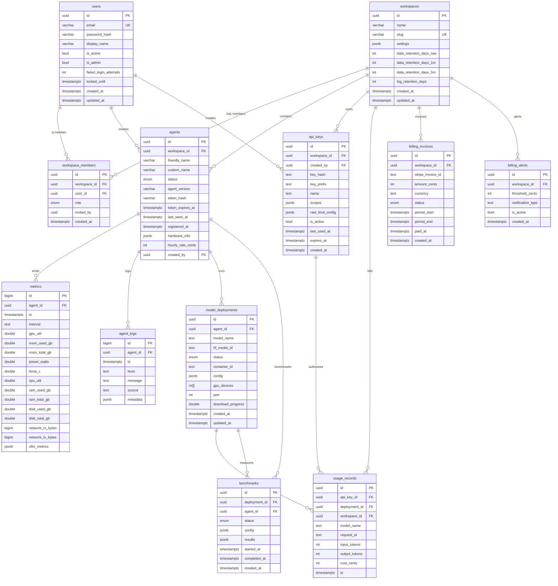

# Data Models — ModelPrism

> **Target Database:** PostgreSQL 15+  
> **Migrations:** Alembic  
> **Audience:** Backend engineers, DBAs, and reviewers

---

## Entity-Relationship Diagram



---

## 1. `users`

Authentication and identity for all human users.

| Column | Type | Constraints | Notes |
|---|---|---|---|
| `id` | `UUID` | `PRIMARY KEY` | `gen_random_uuid()` |
| `email` | `VARCHAR(320)` | `NOT NULL`, `UNIQUE` | RFC 5321 max length |
| `password_hash` | `VARCHAR(255)` | `NOT NULL` | bcrypt / argon2 hash |
| `display_name` | `VARCHAR(128)` | `NOT NULL` | |
| `is_active` | `BOOLEAN` | `NOT NULL`, `DEFAULT true` | Soft disable |
| `is_admin` | `BOOLEAN` | `NOT NULL`, `DEFAULT false` | Platform-wide admin |
| `failed_login_attempts` | `INTEGER` | `NOT NULL`, `DEFAULT 0` | Incremented on failure |
| `locked_until` | `TIMESTAMPTZ` | | `NULL` = not locked |
| `created_at` | `TIMESTAMPTZ` | `NOT NULL`, `DEFAULT now()` | |
| `updated_at` | `TIMESTAMPTZ` | `NOT NULL`, `DEFAULT now()` | Updated via trigger |

**Indexes:**

- `uq_users_email` — UNIQUE on `(email)`
- `idx_users_is_active` — on `(is_active)` for admin-scoped queries

**Relationships:**

- One-to-many → `workspace_members`
- One-to-many → `agents` (via `created_by`)
- One-to-many → `api_keys` (via `created_by`)

---

## 2. `workspaces`

Top-level organisational unit — isolates agents, keys, and billing.

| Column | Type | Constraints | Notes |
|---|---|---|---|
| `id` | `UUID` | `PRIMARY KEY` | `gen_random_uuid()` |
| `name` | `VARCHAR(255)` | `NOT NULL` | |
| `slug` | `VARCHAR(128)` | `NOT NULL`, `UNIQUE` | URL-safe identifier |
| `settings` | `JSONB` | `NOT NULL`, `DEFAULT '{}'` | Feature flags, UI prefs |
| `data_retention_days_raw` | `INTEGER` | `NOT NULL`, `DEFAULT 90` | Raw metrics retention |
| `data_retention_days_1m` | `INTEGER` | `NOT NULL`, `DEFAULT 365` | 1-minute rollup retention |
| `data_retention_days_5m` | `INTEGER` | `NOT NULL`, `DEFAULT 730` | 5-minute rollup retention |
| `log_retention_days` | `INTEGER` | `NOT NULL`, `DEFAULT 30` | `agent_logs` retention |
| `created_at` | `TIMESTAMPTZ` | `NOT NULL`, `DEFAULT now()` | |
| `updated_at` | `TIMESTAMPTZ` | `NOT NULL`, `DEFAULT now()` | Updated via trigger |

**Indexes:**

- `uq_workspaces_slug` — UNIQUE on `(slug)`

**Relationships:**

- One-to-many → `workspace_members`
- One-to-many → `agents`
- One-to-many → `api_keys`
- One-to-many → `usage_records`
- One-to-many → `billing_invoices` (cloud only)
- One-to-many → `billing_alerts` (cloud only)

---

## 3. `workspace_members`

Join table linking users to workspaces with a role-based access level.

| Column | Type | Constraints | Notes |
|---|---|---|---|
| `id` | `UUID` | `PRIMARY KEY` | `gen_random_uuid()` |
| `workspace_id` | `UUID` | `NOT NULL`, `FK → workspaces(id)` | CASCADE delete |
| `user_id` | `UUID` | `NOT NULL`, `FK → users(id)` | CASCADE delete |
| `role` | `ENUM` | `NOT NULL` | `workspace_role` — see below |
| `invited_by` | `UUID` | `FK → users(id)` | `NULL` = self-join via invite link |
| `created_at` | `TIMESTAMPTZ` | `NOT NULL`, `DEFAULT now()` | |

**Enum: `workspace_role`**

```sql
CREATE TYPE workspace_role AS ENUM ('owner', 'admin', 'member', 'viewer');
```

| Value | Privileges |
|---|---|
| `owner` | Full control, transfer, delete workspace |
| `admin` | Manage members, keys, billing |
| `member` | Create/manage agents and deployments |
| `viewer` | Read-only access to dashboards and logs |

**Indexes:**

- `uq_workspace_members_workspace_user` — UNIQUE on `(workspace_id, user_id)`
- `idx_workspace_members_user_id` — on `(user_id)` for "my workspaces" queries

**Relationships:**

- `workspace_id` → `workspaces(id)` (CASCADE)
- `user_id` → `users(id)` (CASCADE)
- `invited_by` → `users(id)` (SET NULL)

---

## 4. `agents`

Registered GPU-backed inference agents running on customer hardware.

| Column | Type | Constraints | Notes |
|---|---|---|---|
| `id` | `UUID` | `PRIMARY KEY` | `gen_random_uuid()` |
| `workspace_id` | `UUID` | `NOT NULL`, `FK → workspaces(id)` | |
| `friendly_name` | `VARCHAR(128)` | `NOT NULL` | Human-readable label |
| `custom_name` | `VARCHAR(128)` | | Optional user-set name |
| `status` | `ENUM` | `NOT NULL` | `agent_status` — see below |
| `agent_version` | `VARCHAR(64)` | `NOT NULL` | SemVer of installed agent |
| `token_hash` | `VARCHAR(255)` | `NOT NULL` | SHA-256 of auth token |
| `token_expires_at` | `TIMESTAMPTZ` | `NOT NULL` | |
| `last_seen_at` | `TIMESTAMPTZ` | | Heartbeat timestamp |
| `registered_at` | `TIMESTAMPTZ` | `NOT NULL`, `DEFAULT now()` | |
| `hardware_info` | `JSONB` | `NOT NULL`, `DEFAULT '{}'` | GPU model, count, driver |
| `hourly_rate_cents` | `INTEGER` | `NOT NULL`, `DEFAULT 0` | Cost for billing |
| `created_by` | `UUID` | `NOT NULL`, `FK → users(id)` | Who registered this agent |

**Enum: `agent_status`**

```sql
CREATE TYPE agent_status AS ENUM (
    'online',
    'offline',
    'degraded',
    'provisioning',
    'deregistered'
);
```

**Indexes:**

- `idx_agents_workspace_id` — on `(workspace_id)`
- `idx_agents_status` — on `(status)` for online-offline filtering
- `idx_agents_last_seen_at` — on `(last_seen_at)` for stale-agent cleanup

**Relationships:**

- `workspace_id` → `workspaces(id)`
- `created_by` → `users(id)`
- One-to-many → `metrics`
- One-to-many → `agent_logs`
- One-to-many → `model_deployments`
- One-to-many → `benchmarks`

---

## 5. `metrics`

Time-series GPU and system metrics emitted by agents. **PARTITIONED by month.**

| Column | Type | Constraints | Notes |
|---|---|---|---|
| `id` | `BIGSERIAL` | `PRIMARY KEY` | |
| `agent_id` | `UUID` | `NOT NULL`, `FK → agents(id)` | |
| `ts` | `TIMESTAMPTZ` | `NOT NULL` | Observation timestamp |
| `interval` | `TEXT` | `NOT NULL` | `'raw'`, `'1m'`, or `'5m'` |
| `gpu_util` | `DOUBLE PRECISION` | | 0.0 – 100.0 |
| `vram_used_gb` | `DOUBLE PRECISION` | | |
| `vram_total_gb` | `DOUBLE PRECISION` | | |
| `power_watts` | `DOUBLE PRECISION` | | |
| `temp_c` | `DOUBLE PRECISION` | | |
| `cpu_util` | `DOUBLE PRECISION` | | 0.0 – 100.0 |
| `ram_used_gb` | `DOUBLE PRECISION` | | |
| `ram_total_gb` | `DOUBLE PRECISION` | | |
| `disk_used_gb` | `DOUBLE PRECISION` | | |
| `disk_total_gb` | `DOUBLE PRECISION` | | |
| `network_rx_bytes` | `BIGINT` | | |
| `network_tx_bytes` | `BIGINT` | | |
| `vllm_metrics` | `JSONB` | | vLLM-specific metrics |

**Partitioning (PostgreSQL 15+):**

```sql
CREATE TABLE metrics (
    id BIGSERIAL,
    agent_id UUID NOT NULL,
    ts TIMESTAMPTZ NOT NULL,
    interval TEXT NOT NULL,
    -- ... all columns above ...
    PRIMARY KEY (id, ts)
) PARTITION BY RANGE (ts);

-- Create monthly partitions via pg_partman or manual:
CREATE TABLE metrics_2026_06 PARTITION OF metrics
    FOR VALUES FROM ('2026-06-01') TO ('2026-07-01');
CREATE TABLE metrics_2026_07 PARTITION OF metrics
    FOR VALUES FROM ('2026-07-01') TO ('2026-08-01');
```

> **Note:** The `PRIMARY KEY` includes `ts` because PostgreSQL requires the partition column in every unique index.

**Indexes (applied per partition or via template):**

- `idx_metrics_agent_id_ts` — on `(agent_id, ts DESC)` — primary query pattern
- `idx_metrics_interval` — on `(interval)` — rollup-type filter

**Retention (enforced by cron/pg_cron):**

- `interval = 'raw'` → drop partitions older than workspace `data_retention_days_raw`
- `interval = '1m'`  → drop partitions older than `data_retention_days_1m`
- `interval = '5m'`  → drop partitions older than `data_retention_days_5m`

**Relationships:**

- `agent_id` → `agents(id)` (CASCADE)

---

## 6. `agent_logs`

Structured log entries emitted by agents during operation.

| Column | Type | Constraints | Notes |
|---|---|---|---|
| `id` | `BIGSERIAL` | `PRIMARY KEY` | |
| `agent_id` | `UUID` | `NOT NULL`, `FK → agents(id)` | |
| `ts` | `TIMESTAMPTZ` | `NOT NULL`, `DEFAULT now()` | |
| `level` | `TEXT` | `NOT NULL` | `'DEBUG'`, `'INFO'`, `'WARN'`, `'ERROR'` |
| `message` | `TEXT` | `NOT NULL` | |
| `source` | `TEXT` | | Component or module name |
| `metadata` | `JSONB` | `DEFAULT '{}'` | Structured context |

**Indexes:**

- `idx_agent_logs_agent_id_ts` — on `(agent_id, ts DESC)`
- `idx_agent_logs_level_ts` — on `(level, ts DESC)` for error-focused queries

**Relationships:**

- `agent_id` → `agents(id)` (CASCADE)

---

## 7. `model_deployments`

A specific model running on an agent (one agent may host multiple deployments).

| Column | Type | Constraints | Notes |
|---|---|---|---|
| `id` | `UUID` | `PRIMARY KEY` | `gen_random_uuid()` |
| `agent_id` | `UUID` | `NOT NULL`, `FK → agents(id)` | |
| `model_name` | `TEXT` | `NOT NULL` | Canonical name, e.g. `'llama-3-70b'` |
| `hf_model_id` | `TEXT` | | HuggingFace repo ID |
| `status` | `ENUM` | `NOT NULL` | `deployment_status` — see below |
| `container_id` | `TEXT` | | Docker/k8s container identifier |
| `config` | `JSONB` | `NOT NULL`, `DEFAULT '{}'` | Engine settings (batch size, quantisation, etc.) |
| `gpu_devices` | `INT[]` | | GPU device indices assigned |
| `port` | `INTEGER` | | Inference port on host |
| `download_progress` | `DOUBLE PRECISION` | `DEFAULT 0` | 0.0 → 100.0 model download % |
| `created_at` | `TIMESTAMPTZ` | `NOT NULL`, `DEFAULT now()` | |
| `updated_at` | `TIMESTAMPTZ` | `NOT NULL`, `DEFAULT now()` | Updated via trigger |

**Enum: `deployment_status`**

```sql
CREATE TYPE deployment_status AS ENUM (
    'pending',
    'downloading',
    'loading',
    'ready',
    'stopped',
    'failed',
    'draining'
);
```

**Indexes:**

- `idx_model_deployments_agent_id` — on `(agent_id)`
- `idx_model_deployments_status` — on `(status)`

**Relationships:**

- `agent_id` → `agents(id)` (CASCADE)
- One-to-many → `usage_records`
- One-to-many → `benchmarks`

---

## 8. `api_keys`

API keys used for programmatic access to inference endpoints.

| Column | Type | Constraints | Notes |
|---|---|---|---|
| `id` | `UUID` | `PRIMARY KEY` | `gen_random_uuid()` |
| `workspace_id` | `UUID` | `NOT NULL`, `FK → workspaces(id)` | |
| `created_by` | `UUID` | `NOT NULL`, `FK → users(id)` | |
| `key_hash` | `TEXT` | `NOT NULL` | SHA-256 of the full key |
| `key_prefix` | `TEXT` | `NOT NULL` | First 8 chars for identification |
| `name` | `TEXT` | `NOT NULL` | Human label |
| `scopes` | `JSONB` | `NOT NULL`, `DEFAULT '[]'` | e.g. `["inference:read", "metrics:read"]` |
| `rate_limit_config` | `JSONB` | `DEFAULT '{}'` | e.g. `{"rpm": 100, "tpm": 100000}` |
| `is_active` | `BOOLEAN` | `NOT NULL`, `DEFAULT true` | |
| `last_used_at` | `TIMESTAMPTZ` | | |
| `expires_at` | `TIMESTAMPTZ` | | `NULL` = never expires |
| `created_at` | `TIMESTAMPTZ` | `NOT NULL`, `DEFAULT now()` | |

**Indexes:**

- `uq_api_keys_key_hash` — UNIQUE on `(key_hash)`
- `idx_api_keys_workspace_id` — on `(workspace_id)`
- `idx_api_keys_key_prefix` — on `(key_prefix)` for "show key starting with…" lookups

**Relationships:**

- `workspace_id` → `workspaces(id)` (CASCADE)
- `created_by` → `users(id)`
- One-to-many → `usage_records`

---

## 9. `usage_records`

Billable inference requests — one row per request served by a deployment.

| Column | Type | Constraints | Notes |
|---|---|---|---|
| `id` | `UUID` | `PRIMARY KEY` | `gen_random_uuid()` |
| `api_key_id` | `UUID` | `FK → api_keys(id)` | `NULL` for anonymous usage |
| `deployment_id` | `UUID` | `FK → model_deployments(id)` | |
| `workspace_id` | `UUID` | `NOT NULL`, `FK → workspaces(id)` | Denormalised for billing queries |
| `model_name` | `TEXT` | `NOT NULL` | Snapshot of model at request time |
| `request_id` | `TEXT` | `NOT NULL` | Upstream provider request ID |
| `input_tokens` | `INTEGER` | `NOT NULL`, `DEFAULT 0` | |
| `output_tokens` | `INTEGER` | `NOT NULL`, `DEFAULT 0` | |
| `cost_cents` | `INTEGER` | `NOT NULL`, `DEFAULT 0` | Computed cost in USD cents |
| `ts` | `TIMESTAMPTZ` | `NOT NULL`, `DEFAULT now()` | |

**Indexes:**

- `idx_usage_records_workspace_id_ts` — on `(workspace_id, ts DESC)` — billing queries
- `idx_usage_records_deployment_id_ts` — on `(deployment_id, ts DESC)` — per-model usage
- `idx_usage_records_api_key_id` — on `(api_key_id)` — per-key audit

**Relationships:**

- `api_key_id` → `api_keys(id)` (SET NULL)
- `deployment_id` → `model_deployments(id)`
- `workspace_id` → `workspaces(id)`

---

## 10. `benchmarks`

Benchmark runs measuring model/agent performance under defined configurations.

| Column | Type | Constraints | Notes |
|---|---|---|---|
| `id` | `UUID` | `PRIMARY KEY` | `gen_random_uuid()` |
| `deployment_id` | `UUID` | `NOT NULL`, `FK → model_deployments(id)` | |
| `agent_id` | `UUID` | `NOT NULL`, `FK → agents(id)` | Denormalised for filtering |
| `status` | `ENUM` | `NOT NULL` | `benchmark_status` — see below |
| `config` | `JSONB` | `NOT NULL` | Parameters, dataset, concurrency |
| `results` | `JSONB` | | Throughput, latency percentiles, scores |
| `started_at` | `TIMESTAMPTZ` | | |
| `completed_at` | `TIMESTAMPTZ` | | |
| `created_at` | `TIMESTAMPTZ` | `NOT NULL`, `DEFAULT now()` | |

**Enum: `benchmark_status`**

```sql
CREATE TYPE benchmark_status AS ENUM (
    'pending',
    'running',
    'completed',
    'failed',
    'cancelled'
);
```

**Indexes:**

- `idx_benchmarks_deployment_id` — on `(deployment_id)`
- `idx_benchmarks_agent_id` — on `(agent_id)`

**Relationships:**

- `deployment_id` → `model_deployments(id)` (CASCADE)
- `agent_id` → `agents(id)` (CASCADE)

---

## 11. `billing_invoices`

> **ModelPrism Cloud only.** Not present in self-hosted deployments.

Stripe-synced invoice records.

| Column | Type | Constraints | Notes |
|---|---|---|---|
| `id` | `UUID` | `PRIMARY KEY` | `gen_random_uuid()` |
| `workspace_id` | `UUID` | `NOT NULL`, `FK → workspaces(id)` | |
| `stripe_invoice_id` | `TEXT` | `NOT NULL`, `UNIQUE` | `inv_xxx` |
| `amount_cents` | `INTEGER` | `NOT NULL` | Total in USD cents |
| `currency` | `TEXT` | `NOT NULL`, `DEFAULT 'usd'` | ISO 4217 lowercase |
| `status` | `ENUM` | `NOT NULL` | `invoice_status` — see below |
| `period_start` | `TIMESTAMPTZ` | `NOT NULL` | |
| `period_end` | `TIMESTAMPTZ` | `NOT NULL` | |
| `paid_at` | `TIMESTAMPTZ` | | |
| `created_at` | `TIMESTAMPTZ` | `NOT NULL`, `DEFAULT now()` | |

**Enum: `invoice_status`**

```sql
CREATE TYPE invoice_status AS ENUM (
    'draft',
    'open',
    'paid',
    'uncollectible',
    'void'
);
```

**Indexes:**

- `uq_billing_invoices_stripe_id` — UNIQUE on `(stripe_invoice_id)`
- `idx_billing_invoices_workspace_id` — on `(workspace_id)`

**Relationships:**

- `workspace_id` → `workspaces(id)` (CASCADE)

---

## 12. `billing_alerts`

> **ModelPrism Cloud only.** Not present in self-hosted deployments.

Spending thresholds that trigger notifications.

| Column | Type | Constraints | Notes |
|---|---|---|---|
| `id` | `UUID` | `PRIMARY KEY` | `gen_random_uuid()` |
| `workspace_id` | `UUID` | `NOT NULL`, `FK → workspaces(id)` | |
| `threshold_cents` | `INTEGER` | `NOT NULL` | Trigger at this amount |
| `notification_type` | `TEXT` | `NOT NULL` | `'email'`, `'webhook'`, `'slack'` |
| `is_active` | `BOOLEAN` | `NOT NULL`, `DEFAULT true` | |
| `created_at` | `TIMESTAMPTZ` | `NOT NULL`, `DEFAULT now()` | |

**Indexes:**

- `idx_billing_alerts_workspace_id` — on `(workspace_id)`

**Relationships:**

- `workspace_id` → `workspaces(id)` (CASCADE)

---

## 13. `alembic_version`

Managed automatically by Alembic. Do not modify manually.

| Column | Type | Constraints | Notes |
|---|---|---|---|
| `version_num` | `VARCHAR(32)` | `PRIMARY KEY` | Revision identifier |

---

## Migration Strategy

- All schema changes are applied via Alembic revision scripts.
- The `metrics` table uses declarative partitioning; partition creation and cleanup are handled by a separate maintenance process (`pg_cron` or application-side scheduler).
- Retention policies are enforced at the partition level (DROP PARTITION) for efficiency.
- `billing_*` tables are created only in Cloud deployments. Self-hosted builds exclude these migrations.
